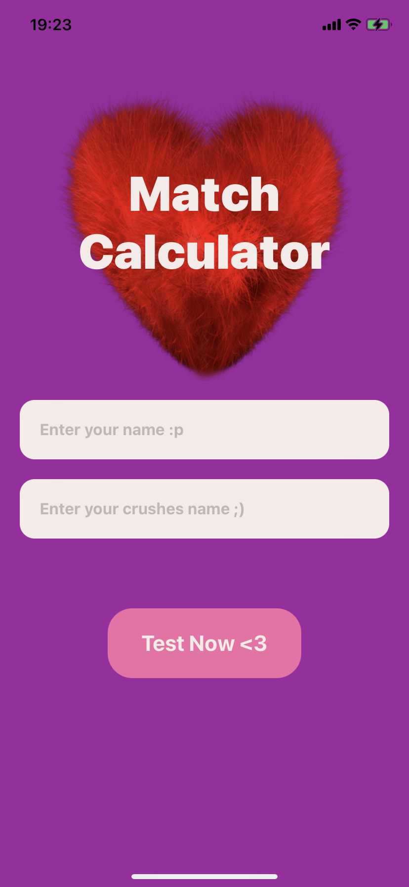
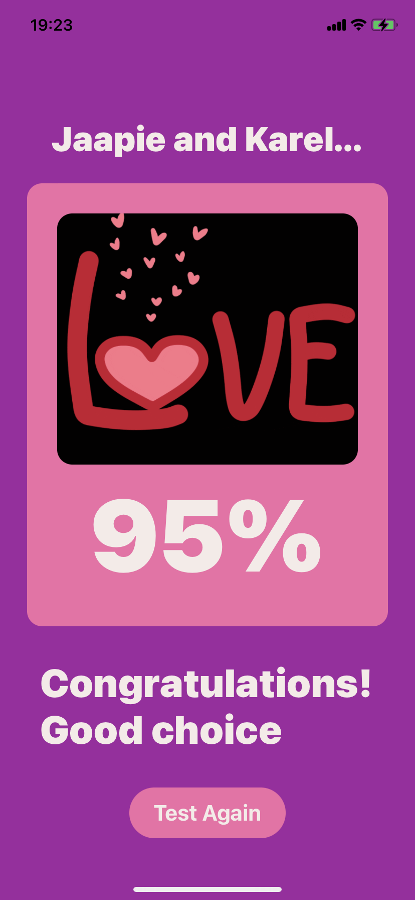

## Love Calculator

Welcome to the Love Calculator app! This app helps you test your love compatibility with your crush. I used this project to practice with React Native Expo and API's




---

**Installation:**

To run this app, you'll need Node.js and npm (or yarn) installed on your machine. You'll also need the Expo CLI. 
For more info: 
[Read Expo documentation](https://docs.expo.dev/workflow/overview/)
[Download Node.js](https://nodejs.org/en)

1. Clone the repository:
   ```bash
   git clone https://github.com/evan-ite/love_calculator.git
   ```

2. Navigate to the project directory:
   ```bash
   cd love_calculator
   ```

3. Install the dependecies:
   ```bash
   npm install
   npm install -g expo-cli
   ```

---

**Running the App:**

Once the dependencies are installed, you can download the Expo Go app in the app store and run the app.
[Read more about Expo Go](https://docs.expo.dev/get-started/expo-go/)

1. start server:
   ```bash
   npx expo start
   ```

This will start the Expo development server. You can then open the Expo Go app on your iOS or Android device, and scan the QR code from the Expo development server to open the app on your device. Alternatively, you can run the app in an iOS or Android simulator.

**Usage:**
Follow the on-screen instructions to test your love compatibility! Enter your name and your crush's name, and click "Test Now <3" to see the results.

**License:**
This project is licensed under the MIT License - see the LICENSE file for details.
